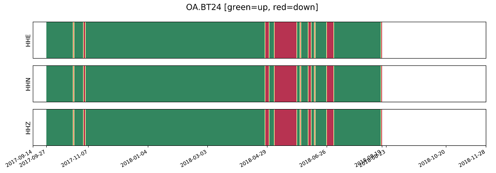
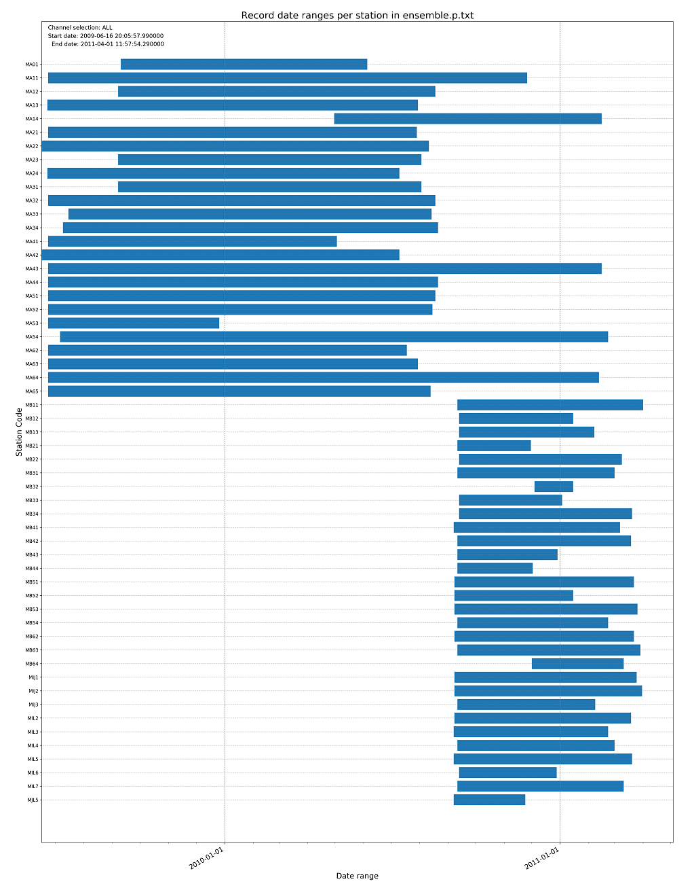

# GPS clock correction tools

This package provides a suite of tools for analysis of GPS clock correctness across station networks.
There are tools to identify the existence of a GPS clock error on a station, and for analyzing the
clock errors to generate clock time corrections.

The clock error identification script are automated batch scripts based on the following techniques:
* relative travel-time (TT) residuals
* ambient noise cross-correlation between station pairs

The clock correction is a semi-automated tool that facilitates easy fitting of piecewise linear
functions to the clock error data, and exporting of the fitted functions to file.

## Relative TT residual analysis

Script `relative_tt_residuals_plotter.py` generate timeline plots of seismic travel time residual
analysis of one network relative to another network to identify potential GPS clock drift. Given an
ensemble of events common to a pair of networks, for each station its travel-time residual for each
event is subtracted from the same event on all common stations of another network, and all such
relative residuals are plotted on a timeline. If a given station's clock drifts, then it will be
visible as a deviation from zero mean relative residual as a function of time. Note that the reference
network can be the same as the network being analyzed, in which case the residuals for each station in
the network are compared against the residuals of all other stations in that same network (but not itself).

The command line options allow the analysis to be run on the degenerate case of a single station
versus one other station. However in general analysing against entire networks is more efficient
and reliable due to the number of aggregated events that get plotted.

### Usage example

Example:

`python relative_tt_residuals_plotter.py --network1 AU --networks2 OA`

This generates a folder `OA_strict` containing a subfolder `AU,GE,IR,IU`. This means network OA has been
analyzed against AU,GE,IR,IU. *Why all these other network codes (GE,IR,IU) when only AU was requested?*
Well AU is treated as a special case, because many Australian network events are catalogued under network
codes GE,IR,IU. So when AU is requested, by default Australian stations from these other network codes
are also added, so as to maximize the available data.

See Options below for explanation of the `strict` qualifier in the folder name.

### Options

When performing the relative TT residual analysis, it is important to apply a certain degree of filtering
to the candidate events that are common to a station pair, otherwise a large number of unreliable picks could
be used and patterns of clock drift will be harder to see.

See `python relative_tt_residuals_plotter.py --help` for documentation on these filter settings. The
default thresholds for these settings will often suffice.

By default, these event filtering settings are applied to both the station being analyzed and the
reference station. However sometimes this results in too few events being plotted to adequately assess
potential clock drift. To allow more events to be plotted, there is an option `--no-strict-filtering` to
not apply filter criteria to the reference station (they are still applied to the target station). This
results in a much larger number of events being plotted, and can resolve ambiguity in interpretation.
However it is better to start with strict filtering, and relax the filtering later if needed. The plot
results for these two filtering modes are stored in separate folders, with `_strict` or `_no_strict`
appended to the folder name.

#### Exporting

If you pass the `--export-path` option to `relative_tt_residuals_plotter.py`, then the raw relative
residuals will be exported to files in that folder, one file per station. For where more than one
residual exists for the same origin timestamp, the median of the values is exported. These exported
csv files can then be imported to the `generateStationClockCorrections.ipynb` script and processed
to create a clock correction file.

### Limitations

Relative travel-time residual analysis is based on picks, and the picking algorithm itself has a
time window of only about ~50 seconds for picking p-wave arrivals. Therefore using the relative
TT residuals we can only detect drifts less than about 50 seconds. For larger clock errors,
cross-correlation analysis is required.

In many cases clocks drift gradually, so residual can effectively detect the onset of drift and the
drift rate. It can also detect clock jumps of less than 50 seconds, but cannot detect sudden clock
jumps of more than 50 seconds.

### Gotchas

The chosen pair of networks for analysis must have a reasonable amount of date overlap in their
deployment dates. Since the relative TT analysis is event based, events can only be plotted when
they are common to two stations, which can only happen if they were deployed at the same time.

## Cross-correlation analysis

This should be mainly documented in `seismic/xcorqc/Readme.md`. The script to use for running
cross-correlation analysis is `seismic/xcorqc/correlator.py`. For detailed documentation of
this script, see help from `seismic/xcorqc/correlator.py --help`.

Cross-correlation analysis can detect much longer time drifts than relative TT residuals,
and is also the means to generate inputs to the clock correction iPython notebook
`generateStationClockCorrections.ipynb`. However it is costly to run and is tricky to get
usable result from. Key difficulties with cross-correlation anaylsis are finding a suitable
reference station whose clock is itself trusted and with overlapping dates, and selecting
the optimal frequency filter band settings.

### Reference station selection

See section "Supporting scripts" for helper scripts for selection of suitable reference
stations. The suggested resources to use:

* Network maps.
* Station activity barcode plots.

### Helper bullets for cross-correlation

* Adjust filter settings according to both instrument type and distance between stations.
* Additional experimentation with filter settings sometimes required.

## Clock correction

Generating a clock correction time series for a station is a semi-automated process based on
iPython notebook `generateStationClockCorrections.ipynb`. The procedure consists of the following
steps:
1. Load the cross-correlation file (`.nc` format) or raw relative residuals (`.csv` format)
1. Visualize the estimated raw corrections to ensure they are feasible to fit lines to.
1. Compute clusters of quasi-linear segments and *iteratively tune the cluster distance coefficients*
   to ensure optimal clustering.
1. Once happy with the clustering, perform linear regression on each cluster and re-check visual fit.
1. Export the linearized clock corrections to csv file.

The resultant clock corrections can then be ingested into other scripts, such as inversion codes or
even the GPS clock analysis scripts themselves.

### Cluster detection coefficients

To date, we have not shown an automatic method of cluster identification for linear segments of GPS
clock drift. We use DBCSAN to perform clustering, but this uses a distance metric that requires some
case-by-case tuning.

The following procedure is suggested for optimizing the clustering:
1. Set all coefficients to zero and confirm all points are allocated to a single cluster.
1. Tune the first coefficient until points clusters that are separated along the time axis
   are adequately discriminated.
1. Tune the second coefficient until noisy points within each cluster are excluded from the parent
   cluster.
1. Only if necessary, tune the third coefficient to discriminate time segments with different slope
   in the clock drift.

Only when the clustering is adequate should the exporting part of the script be run.

## Supporting scripts

In the process of analyzing GPS clock errors, it is often need to have at hand comprehensive metadata
on the stations and networks in question. The following supporting scripts generate relevant visualizations
of network and station metadata to aid in targetted analysis and resolving ambiguity in possible root
causes of clock anomalies.

| File name | Purpose | Notes                     |
|-----------|---------|---------------------------|
| `notebooks/plotNetworkMap.ipynb` | Generate maps of networks showing labelled stations |  |
| `notebooks/study_event_catalog_representation.ipynb` | Plot min and max station dates from an event catalog. |  |
| `notebooks/surveyStationActivityDates.ipynb` | Generate a per-station barcode plotting showing dates that station was active and inactive |  |
| `notebooks/tt_residuals_clock_correction_proto.ipynb` | UNMAINTAINED  | N/A |
| `notebooks/tt_residuals_quality_filtering_study.ipynb` | UNMAINTAINED  | N/A |

Script `notebooks/study_event_catalog_representation.ipynb` does not determine which dates between min and
max when a station was inactive, so in general `notebooks/surveyStationActivityDates.ipynb` gives more detail.
However `notebooks/study_event_catalog_representation.ipynb` puts all the stations of a network onto a
single plot, which is sometimes preferable.

Example barcode plot:

Example network dates plot:

## Other files

`au_island_stations.txt`: List of stations codes from Australian network which are located on islands.

`clock_error_exclusions.csv`: Data file listing stations and date ranges that should be excluded from traveltime tomography analysis due to suspect GPS clock during specified time intervals.

## References

[Cross-correlation.](https://academic.oup.com/gji/article/214/3/2014/5038378)

