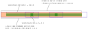

# Cross-Correlation Workflow

The cross-correlation functionality works off of a FederatedASDF_Dataset source. Users 
specify two subsets of stations (or * for all stations available in the ASDF files) either 
as command-line arguments or as separate text-files to be cross-correlated. 
Depending on the parameterization, a Cartesian product of two lists of station-names defines 
station-pairs that are to be cross-correlated -- see help for `correlator.py` for details.

Cross-correlation results are written out as NetCDF-4 files for each station-pair. [Panoply], a freely available cross-platform tool, which is also available on NCI VDIs, can be used to visualize the results interactively. A quick intro to [Panoply] is available [here].


### Setup validation

The Python setup can be tested for running cross-correlations on Gadi using `validate_xcorr_setup.py` in 
folder `hiperseis/seismic/xcorqc`. The script should be run directly from that folder, not from elsewhere.

Run `python validate_xcorr_setup.py` from the command line. Various output will appear explaining the item
being tested and the result, plus output from Python libraries. If the test succeeds, the last line of output
should read `SUCCESS!`.

# Launching the Cross-Correlator

The cross-correlator script is launched as follows, for detailed help on supported parameters:

```python hiperseis/seismic/xcorqc/correlator.py -h```

The figure below shows how keys parameters interrelate:



Another key parameter, READ_AHEAD_WINDOWS, determines the amount of data being read in -- depending on 
the window-overlap, window-buffer-length and whether interval-stacking is enabled -- in each IO 
call. In the default mode, all cross-correlated windows are output, whereas with ```--stacking-interval-seconds``` 
specified, stacked windows over each interval are output.

Key input parameters:

* WINDOW_SECONDS (WS) 
* WINDOW_OVERLAP (OLAP)
* --stacking-interval-seconds (SIS)
* --window-buffer-length (WBL) 
* READ_AHEAD_WINDOWS (RAW)

The input parameters above dictate the following:

* Data read in per IO call, DISK_READ_SECONDS (DRS)
* Number of windows stacked per interval (NSW), if interval-stacking is enabled

## Default Mode
In the default mode (without interval-stacking),  

DRS = WS * (1 - OLAP) * RAW + WS * WBL * 2 + OLAP * WS * 2

A table showing example parameterizations and their implications is as follows:

| WS   | OLAP | WBL | RAW | DRS      |
------|------|-----|-----|----------|
| 3600 | 0.1  | 0.2 | 3   | 11880    |
| 3600 | 0.1  | 0.1 | 24   | 79200  |

Typically, on a Lustre filesystem, the value of DRS should amount to a couple of days (e.g. in 
the second row above) to help improve IO efficiency. Note that this rule of thumb also applies 
for the interval-stacking mode below.

## Interval-stacking Mode
With interval-stacking enabled:

DRS = WS * RAW

NSW = floor( (SIS - WS*(OLAP + 2*WBL)) / ((1 - OLAP)*WS) )

A table showing example parameterizations and their implications is as follows:

| WS   | OLAP | SIS   | WBL | RAW | DRS   | NSW |
------|------|-------|-----|-----|-------|-----|
| 3600 | 0.1  | 10800 | 0.2 | 3   | 10800 | 2   |
| 3600 | 0.1  | 10800 | 0.1 | 3   | 10800 | 3   |

Note that unlike in the default mode, in the interval-stacking mode it is critical to set 
WS, OLAP, SIS, and RAW judiciously -- otherwise it can lead to loss of usable data. The first row 
in the table above illustrates such a scenario where, even though 3 hours of data are read in, and 
with an overlap of 10%, only 2 windows are stacked per interval. This is because WBL is too large 
in this case, leading to the truncated third window, as shown in the figure above. A smaller 
WBL=0.1 in the second row above rectifies the significant loss of data per stacking-interval.

General rules of thumb:

* WBL should be ~OLAP
* SIS should be an integer multiple of WS


# Visualizing Cross-Correlation Results

As there are many technical aspects to interpreting the time series cross-correlation results
generated by the above Cross-Correlation Workflow, functions are provided to convert `.nc` files
to a standard graphical visualization of the cross-correlation time series.

The following three functions from module `xcorr_station_clock_analysis` are used as entry points
for this purpose:

|Function | Purpose |
|---------|---------|
|`plot_xcorr_file_clock_analysis`| For a single `.nc` file. Does not overlay runtime options. |
|`batch_process_xcorr`| For an iterable set of `.nc` files, plot each. Adds traceability information (runtime configuration parameters).|
|`batch_process_folder`| Run `batch_process_xcorr` on all `.nc` files in a specified folder.|


[Panoply]:https://www.giss.nasa.gov/tools/panoply/
[here]:http://www.meteor.iastate.edu/classes/mt452/EdGCM/Documentation/EdGCM_Panoply.pdf
